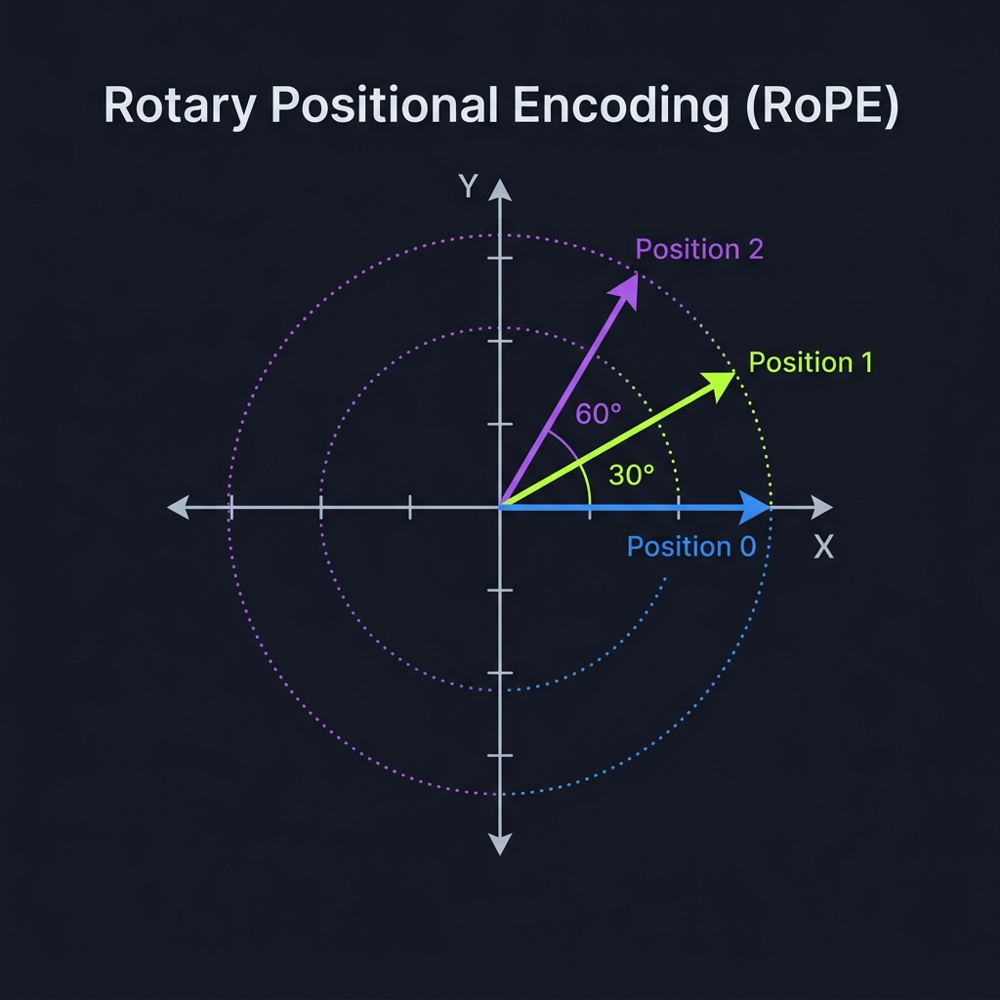

# Transformer: Positional Encoding (RoPE)

## 🧠 General Introduction
The Transformer's greatest strength is **Parallelism**, but its greatest weakness is that it is **Order-Blind**. 

To a Transformer, the sentences `"man bites dog"` and `"dog bites man"` look exactly the same because it processes all word vectors at once. It sees a "bag of words" but doesn't know which came first. **Positional Encoding** is the "Clock" we give the model so it can keep track of word order.

---

---

## 🏗️ How it Works: The "Twist" Logic

### 1. The Pairing Strategy (Slicing the Vector)
How do we turn one long list of 768 numbers into 2D pairs? We don't have 768 separate graphs; we have one vector that we "pretend" is 384 different points. We do this by splitting the vector exactly in half:

*   **Left Half (Indices 0 to 383):** We treat these as 384 **X-coordinates**.
*   **Right Half (Indices 384 to 767):** We treat these as 384 **Y-coordinates**.

**The Logic:**
*   Pair #1 is formed by `(Vector[0], Vector[384])`.
*   Pair #2 is formed by `(Vector[1], Vector[385])`.
*   ... and so on.

### 2. The Graph
Each of these 384 pairs is treated like a point on a 2D graph (as seen in the diagram below).

3.  **The Rotation:** We rotate all 384 points by an angle determined by the word's position. 



*As the position index increases (Pos 0 -> Pos 1 -> Pos 2), the vector "twists" further around the origin.*

---

## 🚀 The RoPE Lifecycle: Step-by-Step ("hello world")

### Phase 1: Input (The Raw Vectors)
We have our vectors from the Embedding layer:
*   **"hello" (Position 0):** Its pairs start at $(x_0, y_0)$.
*   **" world" (Position 1):** Its pairs start at $(x_1, y_1)$.

### Phase 2: Applying the Twist
For every pair in the vector, we apply the rotation formula:
*   **Position 0:** Rotation angle = $0$. The vector remains in its original orientation.
*   **Position 1:** Rotation angle = $1 \times \theta$. Every pair in the vector "twists" by a specific amount.

### Phase 3: The Multi-Frequency "Secret"
In a real Transformer, we don't rotate every pair by the same amount. Each pair in the 768-dim vector has its own **Base Frequency**.
*   The **first pairs** rotate very **fast** (changing significantly even with small position moves).
*   The **last pairs** rotate very **slowly** (barely moving even over long distances).
*   **The Result:** This creates a complex, unique geometric "signature" for every single position. A Transformer can tell the difference between Position 1 and Position 100 because the "twist" looks completely different across all those pairs.

---

## 🧐 Why is RoPE better than the old way?

### 1. Relative Position is Key
Older models just added a fixed number to the vectors. This was like labeling houses with absolute street numbers (1, 2, 3). RoPE is like giving the model a **Compass**. By comparing the *difference* in rotation between two words, the model can instantly calculate: *"This word is exactly 3 steps behind me."*

### 2. Generalization
Because rotation is a continuous mathematical function, the model can often understand positions it never saw during training (e.g., if it was trained on 2048 tokens, it can still make sense of Position 3000 because the rotation logic still holds).

---

## 💻 Code Implementation (The Math)

In our `model.py`, this is handled by pre-computing a "rotation cache" of sine and cosine values.

## 💻 Code Implementation (The Math)

In our `model.py`, we apply the rotation using the standard 2D rotation matrix formula. 

```python
def apply_rope(x, cos, sin):
    # x shape: (Batch, SeqLen, Dim) -> e.g., (1, 2, 768)
    
    # 1. Slicing: Split the 768-dim vector into two 384-dim halves
    # We treat the first half as X-coordinates and the second as Y-coordinates.
    x1, x2 = x[..., :d//2], x[..., d//2:]
    
    # 2. Rotation Matrix: x' = x*cos - y*sin | y' = x*sin + y*cos
    # This rotates all 384 pairs simultaneously.
    x_rotated = x1 * cos - x2 * sin
    y_rotated = x1 * sin + x2 * cos
    
    # 3. Re-assembly (torch.cat):
    # We glue the new X's and Y's back together into a single 768-dim vector.
    # dim=-1 is a shortcut for "The Last Dimension" (the 768 numbers).
    return torch.cat([x_rotated, y_rotated], dim=-1)
```

### 🔍 Deep Dive: The `cat` and `dim=-1`
*   **Why `cat`?** The rest of the Transformer block expects one solid vector of 768 numbers. `torch.cat` (concatenate) acts as the "glue" that combines our rotated halves back into a standard word vector.
*   **Why `dim=-1`?** This is a Python-style shortcut that means "The Last Dimension." In our data, the dimensions are `(Batch, Sequence, Embedding)`. By using `-1`, we ensure the gluing happens inside the **Embedding** list (the 768 numbers).

### 🔑 Key Technical Traits
*   **No New Parameters:** Unlike the Embedding layer, RoPE doesn't have "weights" to learn. It is a pure mathematical function based on the word's index.
*   **Preserves Magnitude:** Rotating a vector doesn't change its length (energy), only its direction. This keeps the signals stable as they travel through the model.
